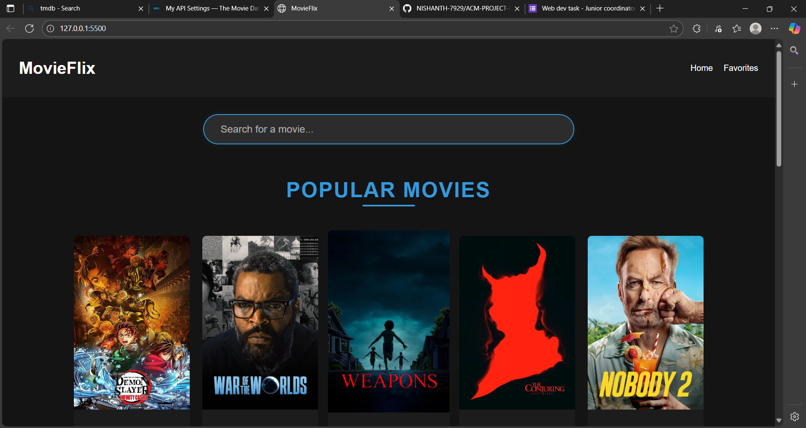
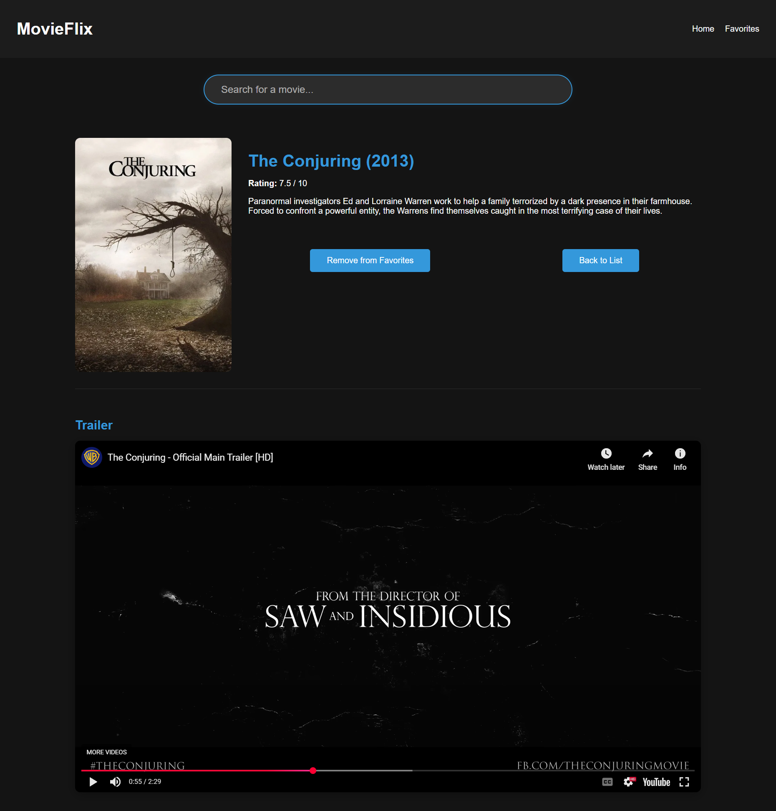
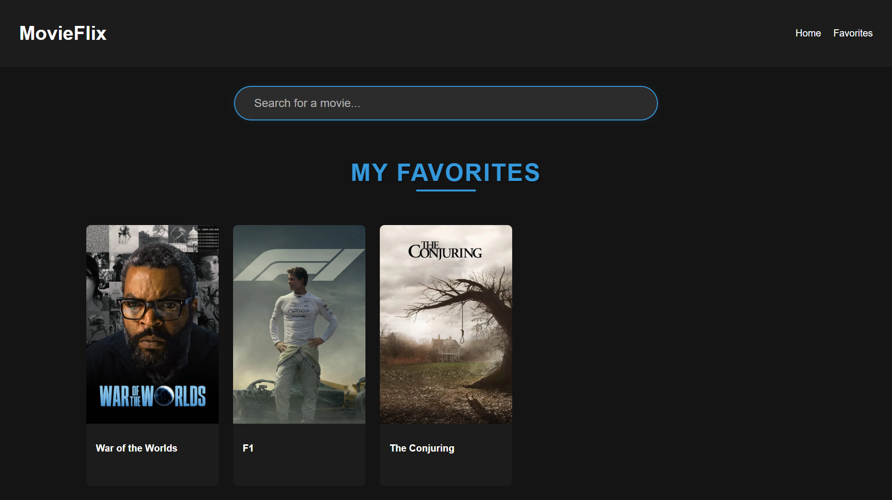
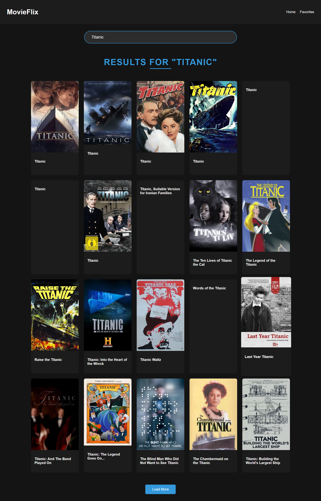

# MovieFlix

A movie discovery web application that allows users to browse popular movies, search for specific titles, and view detailed information including trailers.

## Setup

1. Clone the repository:
```bash
git clone https://github.com/NISHANTH-7929/ACM-PROJECT-MovieFlix.git
cd ACM-PROJECT-MovieFlix
```

2. Set up your configuration:
   - Copy `config.example.js` to `config.js`
   - Replace `your_tmdb_api_key_here` with your actual TMDB API key in the `config.js` file

3. Open `index.html` in your browser

## Features

- Browse popular movies
- Search for movies
- View movie details including trailers
- Add movies to favorites
- Responsive design

## API

This project uses the TMDB (The Movie Database) API. You'll need to:
1. Sign up at https://www.themoviedb.org/
2. Get your API key from your account settings
3. Add the API key to your `config.js` file

## Configuration

Create a `config.js` file in the root directory with the following:

```javascript
const config = {
    tmdbApiKey: 'your_tmdb_api_key_here'
};

export default config;
```

Replace `your_tmdb_api_key_here` with your actual TMDB API key.

## Screenshots

Here are some screenshots of the application in action:

### Home Page


### Movie Details


### Favorites


### Search Results
